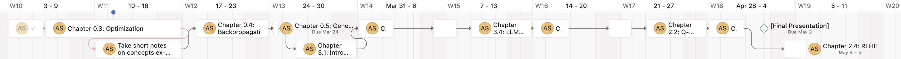

This is my copy of the [Alignment Research Engineer Accelerator (ARENA) program](https://www.arena.education/). The github repository for the original curriculum can 
be found [here](https://github.com/callummcdougall/ARENA_3.0).

## Agenda 

| Week of 2025 | Progress Updates                                                                                                                                                                                                                                             |
|--------------|--------------------------------------------------------------------------------------------------------------------------------------------------------------------------------------------------------------------------------------------------------------|
| 5            | Linear Algebra review (rank, singular value decomposition, eigenv*s)                                                                                                                                                                                         |
| 6            | Deep learning review, Chapter 0.0                                                                                                                                                                                                                            |
| 7            | Chapter 0.0, Chapter 0.1, guided discussion on different research areas within AI Safety and research directions outlined by [Anthropic's alignment team](https://alignment.anthropic.com/2025/recommended-directions/)                                      |
| 8            | Chapter 0.1, outlining how evaluations are conducted, discussing [METR's bug bounty program and desiradata](https://metr.org/blog/2023-12-16-bounty-diverse-hard-tasks-for-llm-agents/), and compiling list of bugs that could be used as evals, Chapter 0.2 |
| 9            | (Post-conference off week)                                                                                                                                                                                                                                   |
| 10           | Chapter 0.2 and meta-tasks (Asana task list for remaining chapters to be completed and [compiling list of papers to read](https://docs.google.com/spreadsheets/d/1a0Q0ZUiKUG17ZAQXsr-44MBYXtnm6mukUz95MGEcpe8/edit?usp=sharing)                              |
| 11           | Chapter 0.2, Chapter 0.3                                                                                                                                                                                                                                     |

## Planned timeline

**Figure 1.** Asana timeline for the completing the ARENA curriculum. The timeline was 
planned with one key assumption: that it takes ~4 hours to complete each subchapter when 
timed. We have 9 hours of programming meeting per week, which allows us to complete 
around two subchapters each week. Note that subchapters 1.2 - 1.5 have been omitted 
from this timeline as evaluations and reinforcement learning are larger priorities 
than mechanistic interpretability, but some portions from that chapter will be 
done after completing *Chapter 2.4: RLHF* after the 5th of May, 2025.